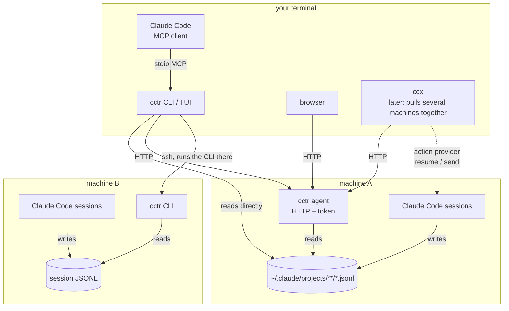

# cctr roadmap

Everything a Claude Code transcript can express, from one tool: search, reading, statistics, visualization, diff attribution, export, live view. Phases are GitHub milestones (M0 to M10). They carry an order and a definition of done, not dates.

## Purpose

- Read the session JSONL Claude Code writes and make it queryable from four surfaces: CLI (JSON by default), MCP server, Web UI, TUI
- Absorb [cchist](https://github.com/TakashiAihara/cchist) and replace it, so there is one entry point for transcripts
- End up inside [ccx](https://github.com/TakashiAihara/ccx). ccx's host side (CLI, the resident `ccxd`) is Go and its hub (`ccx-center`) is TypeScript; the TypeScript core built here lands in the hub. `cctr` is the entry point until then

## Scope

### In

- Data source: the session JSONL under `~/.claude/projects/<encoded-cwd>/<session>.jsonl`, plus the subagent transcripts beside it
- Four surfaces over one query API
- One agent process per machine, so other machines can read this one over HTTP. Aggregating machines is ccx's job; cctr's agent exists so there is something to aggregate
- Reaching a machine over SSH by running its `cctr` there, for people who would rather not open a port

### Out

- Anything specific to one person's environment. This is a public repository
- Transcripts of other agents (codex, opencode, gemini-cli). Recorded as a future question; the schema is tuned to Claude Code
- Writing or deleting transcripts. cctr is read-only on them
- Running sessions or sending them instructions. cctr shows the command and hands the session key to an action provider; executing is ccx's job. The provider interface exists from Phase 9 so the viewer can grow that button when ccx supplies the provider

## What a transcript can express

Checked against real files from Claude Code 2.1.26x. The table is the population that every feature is drawn from.

| Information | Where it is | Phase |
|---|---|---|
| Session identity (id, cwd, branch, Claude Code version, first and last timestamp) | `sessionId` `cwd` `gitBranch` `version` `timestamp` on `user` / `assistant` records | 0 |
| Session title | `ai-title` record (`aiTitle`) | 0 |
| Conversation tree and the current leaf | `uuid` / `parentUuid`, `last-prompt.leafUuid` (after a rewind, this is what says which branch is current) | 3 |
| Subagent conversations and their attributes | `isSidechain` / `agentId`, `<session>/subagents/agent-<id>.jsonl` and its `.meta.json` (`agentType`, `description`, `model`, `spawnDepth`) | 3 |
| Text, thinking, tool calls, tool results | `message.content[]` blocks `text` / `thinking` / `tool_use` / `tool_result` | 3, 4 |
| Compaction boundaries | `user` records with `isCompactSummary: true` | 3 |
| Session summary for the resume list (older versions) | `summary` record (`summary`, `leafUuid`); absent in 2.1.26x, replaced by `ai-title`. Needs an older fixture | 3 |
| Model, effort, stop reason | `assistant.message.model`, `effort`, `stop_reason` | 5 |
| Tokens (input, output, cache read, cache create, server tool use, iterations) | `assistant.message.usage`, aggregated per `message.id` (see notes) | 5, 6 |
| Turn duration and message count | `system` record with `subtype: turn_duration` (`durationMs`, `messageCount`) | 5, 6 |
| Session totals (cost, API time, lines changed, tool time, per-model breakdown) | `cost-state` record (`totalCostUSD`, `totalAPIDuration`, `totalAPIDurationWithoutRetries`, `totalDuration`, `totalToolDuration`, `totalLinesAdded`, `totalLinesRemoved`, `modelUsage`, `hasUnknownModelCost`) | 5 |
| Hook results | Stop hooks: `system` record `subtype: stop_hook_summary` (`hookInfos`, `hookErrors`). PreToolUse / PostToolUse: `attachment.type` `hook_success` / `hook_non_blocking_error` / `hook_additional_context`. Counting both double-counts | 5 |
| Permission mode and denials | `permission-mode` record (`bypassPermissions`, ...) and `mode` record (`normal`, ...) are different things; denials are `user.toolDenialKind` | 5 |
| Where a prompt came from (typed by a person, or from another session or task) | `user.promptSource`, `user.origin` (`{"kind":"human"}`, `{"kind":"task..."}`) | 5, 9 |
| Interrupts and queued prompts | `queue-operation` record (`enqueue` / `dequeue` / `remove`), `attachment.queued_command` | 5, 6 |
| Files edited, with before and after | `tool_use` input of Edit / Write / MultiEdit and `toolUseResult` (`oldString`, `structuredPatch`). The pre-edit content comes from here | 7 |
| Files edited outside the session | `attachment.type: edited_text_file` | 7 |
| Backup references for edits | `file-history-snapshot` record. In real data `trackedFileBackups` is always empty and the content is not in the JSONL; an optional source, used only when the reference resolves | 7 |
| Pull requests | `pr-link` record (`prNumber`, `prUrl`, `prRepository`). Used before any inference from git log | 7 |
| Bash commands run | `tool_use` input of Bash | 4, 5 |
| Skills and slash commands used | `Skill` tool_use `input.skill`, `<command-name>` tag on user records, `attributionSkill` | 5 |
| Remote Control linkage | `bridge-session` record (`bridgeSessionId`, `ownerAccountUuid`, `ownerOrganizationUuid`; the last two are redaction targets), `attachment.type: remote_session_change` | 8, 9 |
| Context growth | `attachment.type: total_tokens_reminder` / `session_context` / `environment` / `model` | 5, 6 |

Notes

- Record types and fields come and go with Claude Code versions. The parser keeps unknown records with their raw payload and types only what it knows. `atis-latch` (one per session, purpose unknown) is the fixture for "unknown is kept"
- One API response is written as several `assistant` lines, one per content block (`apiBlockIndex`), each with the same `message.id` and the usage as of that point. Summing every line over-counts input by about 2x on real data (2.07x measured). Usage is aggregated per `message.id`; the last line for an id wins. cchist has this double count
- `attachment.type` has 24 values in real data. The table lists the ones a phase uses; the rest are kept like unknown records
- Sessions of tens of megabytes exist. Everything streams line by line
- A session being written has a half line at the end; it is dropped

## Architecture

- `packages/core` is independent: parser, session model, index, query API. It is TypeScript and importable from TypeScript
- One interface, `Source`, covers "this machine", "a cctr over HTTP" and "a cctr over SSH". Surfaces talk to a `Source`; a remote machine is just another implementation. `MultiSource` asks several at once and reports the ones that did not answer instead of failing
- The agent is the HTTP face for other machines. The local CLI and the MCP server read the files directly, so an agent that is down does not make MCP answer empty. Watching and indexing as a resident process is what ccx's `ccxd` already does; cctr's agent stays thin and is replaced by `ccxd` on absorption
- The SSH path needs no agent, no port, no token. Whoever can `ssh` in can already read the files
- Incremental indexing takes a transcript path. File watching is one caller of it; after absorption the SessionStart / Stop hooks that `ccxd` collects are the trigger
- Lines that could not be parsed stay in the index as `parsed=false`, so "the parser broke" and "that line was never there" stay distinguishable
- Two clocks: the transcript's `timestamp` (Claude Code's clock) and the time cctr indexed it (cctr's clock). They drift across machines
- Core returns facts, never states. "Last record type" and "time since last observation" are facts; `working` / `waiting` are names the UI layer puts on them. `ended` cannot be decided: a transcript has no terminal record
- Action provider: the slot for "do something with this session" (resume, send an instruction). cctr ships none, so the buttons do not appear; when ccx registers one, the viewer can start a past session and talk to it. cctr passes the session key and never manages the process

## Decisions

Decided with the recommended option so work can proceed; each can be revisited.

| Topic | Decision | Why |
|---|---|---|
| Language and runtime | Bun + TypeScript, commander for the CLI, single binary | Same as cchist; the author's default. ccx's host side is Go, so the absorption target is its TypeScript hub. A one-shot CLI is not hurt by Bun's `--compile` size |
| Index | SQLite (`bun:sqlite`) + FTS5, under `~/.local/state/cctr/`, never inside `~/.claude/` | Ships with the runtime, no native dependency. A derived cache, replaceable — as long as FTS5's `MATCH` syntax never reaches the CLI or MCP. The search query language is cctr's own and is translated to FTS5 |
| Session primary key | `(machine, user, session_id)` | Same shape as ccx's `SessionKey`; keying on `session_id` alone means re-cutting the schema in Phase 10 |
| Machine id | hostname by default, overridden by `CCX_MACHINE` | No cctr-only setting to migrate later |
| CLI default output | JSON; `--format table` for people, `--format id` for a bare id | stdout is data, stderr is log. cchist defaults to a table with `--json` opt-in, so the default flips; the migration guide says so |
| Agent API | Connect + protobuf: `TranscriptService` in `packages/proto`, served on Hono at `127.0.0.1:7411` by default; any other bind is explicit and still token-gated | ccx's contract style (`packages/proto`, buf, connect-es on Hono), so the service moves into `ccxd` / the hub without a rewrite. Connect speaks JSON over plain POST, so curl and browsers need nothing extra |
| SSH path | `ssh <target> cctr <subcommand>`, JSON over stdout | No new authentication; reaching the files by ssh already grants reading them |
| Web UI | React + Vite SPA served by the agent's Hono, built into the binary | Single binary stays single |
| MCP transport | stdio first; HTTP MCP later. MCP reads the files directly, no agent needed | Claude Code's local MCP default |
| Redaction | Export and MCP output are redacted by default; the CLI prints raw and takes `--redact`. A minimal detector (usernames in paths, uuid-shaped ids, token shapes) sits on the MCP path from Phase 2 | MCP answers land in Claude's context. The CLI is read by the person whose files these are |
| cchist compatibility | Every cchist subcommand keeps its name: `sessions list` / `sessions latest`, `show`, `path`, `outline`, `read`, `stats`, `tokens`, `tools`, `bash`, `files`, `activity`, `commands`, `search`, `completion`. The migration guide maps each to the phase it lands in | Least rewriting for the people and scripts calling it |
| State | Core emits facts (last record type, elapsed), never state names | ccx's "emits facts, never recommendations" |

## Order

The CLI comes first, because it is what gets used first: Phase 0 is the core plus the CLI reading this machine and others; Phase 1 brings the CLI to cchist parity; the other three surfaces (MCP, Web, TUI) start in Phase 2 on top of a CLI that already does everything cchist did. Search, statistics and the rest then land on all four surfaces at once.

## Phase 0: foundation

Purpose: the core, the agent, the CLI, and reading other machines. `cctr sessions list --host all` returns every registered machine's sessions over HTTP or SSH.

- Parser: line-streaming JSONL, typed known records, unknown records kept, half-written last line dropped
- Fixtures: one directory per Claude Code version under `packages/core/test/fixtures/<version>/`, parser tests run across all of them
- Session model: `SessionMeta` aggregated in one pass; usage per `message.id`
- Sources: `Source` interface with local, HTTP and SSH implementations; `MultiSource` over several
- Agent: `cctr agent run|start|stop|status|token`, `TranscriptService` (`GetMeta` / `ListSessions` / `GetSession` / `ReadRecords`) behind a bearer token, pid on `GetMeta`
- Remotes: `cctr remote add <name> --url|--ssh`, `--host <name|all|list>` on every read, `host:id`
- CLI: commander, JSON by default, `--format table`, `path` (cchist compat)
- Distribution: `bun build --compile`, `scripts/install.sh` with checksum, GitHub Releases

Done when

- Parser tests pass on the fixtures (one Claude Code version at first; more as they are collected)
- An E2E lists sessions from a second machine over both HTTP and SSH
- `curl ... | sh` installs a working binary on a fresh machine

Status: done in PR #1.

## Phase 1: cchist parity on the CLI

Purpose: everything cchist did, from `cctr`, on every registered machine. After this phase cchist is deprecated.

- `show` (`--tools` / `--thinking`), `outline`, `read` (`m3..m7`, token budget)
- `search` (substring, `--regex`, `--case`, `--role`, `--thinking`, `--context`, `--limit`, `--session`, `--group`)
- `stats --by day|repo|model|session`, `tokens`, `tools --expand-skills`, `bash --top`, `files --top`, `activity`, `commands --source slash|tool|all`
- `completion bash|zsh|fish`
- Every one of them takes `--host`; the agent gains the procedures the remote ones need (`ReadRecords` already covers most)
- Usage aggregated per `message.id` everywhere (cchist double-counts)
- `docs/migration-from-cchist.md`: the command table and the differences (JSON default, `sessions latest` output, usage numbers)

Done when

- Each cchist subcommand has a cctr counterpart with the same or better output
- cchist's README announces the deprecation and points here

## Phase 2: the other surfaces

Purpose: the MCP server, the Web UI and the TUI exist and list sessions; later phases then add to all four at once.

- Index: SQLite schema, incremental update by file mtime and offset, `cctr index` to rebuild
- MCP skeleton: stdio, `sessions_list` and `session_read`, through the minimal redactor
- Web skeleton: `cctr serve`, sessions list and one session screen
- TUI skeleton: `cctr tui`, sessions list, on Ink
- Redaction: the minimal detector (usernames in paths, uuid-shaped ids, token shapes) on the MCP path

Done when

- An E2E shows the same session list from CLI, MCP, Web, TUI

## Phase 3: reading

Purpose: one session, readable by a person on every surface (the CLI part landed in Phase 1).

- `show`: metadata plus the conversation; `--tools` / `--thinking` toggles
- `outline`: one line per turn (who, what, tool count, tokens)
- `read`: message ranges (`m3..m7`) with a token budget
- `thread`: walk the `parentUuid` tree; the current branch is the one `last-prompt.leafUuid` points at; rewinds become visible
- `subagents`: list sidechains with their `.meta.json` attributes, descend into one
- Compaction boundaries shown, with what was summarized away
- Shell completion
- Web: session screen (turns folded, tool I/O expandable, thinking toggle)
- TUI: browse a session, jump from a search hit
- MCP: `session_show`, `session_read`

Done when

- A 50 MB session, read directly without the index, shows its first screen in the Web UI within 2 seconds

## Phase 4: search

Purpose: the whole history, in seconds, on every surface (the CLI scan landed in Phase 1; this adds the index and the other surfaces).

- A query language of cctr's own, translated to FTS5 `MATCH` (built first, so FTS5 syntax never leaks out)
- Full text (FTS5), regex (a scan outside the index), case toggle
- Filters: role (user / assistant / thinking / tool), time, repo (cwd), branch, model, session
- Tool inputs are searchable: Bash commands, edited file paths, skill names. cchist left these out
- Grouping by session, most hits first, with context around each hit
- Every hit carries a session id, a turn position, and a ready-made `read` range
- Web: search screen, hits open the session screen
- MCP: `search`, so Claude can ask "how did I fix this error before"

Done when

- Full-text search over 1 GB of indexed history answers within 1 second
- Regex search accepts the same filters

## Phase 5: statistics

Purpose: statistics beyond what cchist had, on all four surfaces.

- `stats --by day|repo|model|session|branch`: tokens (with cache breakdown), cost, turns, tools, duration
- `tokens`, `tools` (`--expand-skills`), `bash --top`, `files --top`, `activity`, `commands`
- New axes: hook runs and failures (Stop from `system`, PreToolUse / PostToolUse from `attachment`, never both), permission denials, interrupts, prompt origin (`promptSource`), effort distribution, cache hit rate, turn duration
- `cost-state` totals (per `modelUsage`) reconciled against a recount from usage; usage is aggregated per `message.id`
- Web: a numbers dashboard (tables; charts are Phase 6)
- MCP: `stats`

Done when

- Every axis renders on all four surfaces from the same numbers

## Phase 6: visualization

Purpose: turn the numbers into pictures. Web is primary; the CLI emits the same data as JSON.

- Per-session timeline: turns, tool calls, and waits (for the user, for the API, for tools) on a time axis
- Cross-session gantt: which sessions overlapped
- Day / hour heatmap (activity)
- Token burn: cumulative tokens through a session, context growth (`total_tokens_reminder`), compaction points (`isCompactSummary`)
- Interrupts and queued prompts (`queue-operation`) on the timeline
- Tool flow: which tool follows which
- Web: one screen per chart; colors, axes and gaps follow the dataviz conventions (gaps are drawn as gaps, never bridged)
- CLI: `timeline` / `gantt` / `heatmap` emit JSON, never draw

Done when

- Every chart renders from real data with gaps shown as breaks
- The data behind each chart equals the CLI's JSON

## Phase 7: diffs and attribution

Purpose: answer "which session last touched this file" and "what did this session change".

- Reconstruct edit history from Edit / Write / MultiEdit tool calls and `toolUseResult` (`oldString`, `structuredPatch`)
- `file-history-snapshot` as an optional source, used only when its reference resolves
- `edited_text_file` (changes made outside the session) folded into attribution
- File contact graph: sessions x files (the data is produced here, not in visualization)
- `changes <session>`: files touched and a unified diff
- `blame <path>`: the sessions that touched a file, in order
- PRs straight from `pr-link` records; commits inferred from branch, cwd and git log times (candidates, not facts)
- Web: a "changes" tab on the session screen, and the reverse lookup from a file
- MCP: `session_changes`, `file_blame`

Done when

- Reconstruction of all three edit tools is fixture-tested
- A reconstructed diff applies back to the file (round trip)

## Phase 8: export and sharing

Purpose: get a session out, redacted first.

- `export <session> --format md|html|json`, with turn ranges
- Redaction: secrets (tokens, keys, connection strings) and PII (emails, phone numbers, usernames in paths); on by default, `--raw` turns it off; counts of what was hidden go to stderr
- Pluggable detectors (a set of patterns plus an extension point). Fixtures include `bridge-session` account and organization uuids
- Excerpts: a shareable markdown from a search hit or a turn range
- Web: export from the session screen, with a redaction preview
- MCP: every answer passes through redaction (in place since Phase 2)

Done when

- A negative control exists: a fixture seeded with secrets is redacted, and a leak fails the test
- Nothing secret leaves without `--raw`

## Phase 9: live

Purpose: follow sessions as they run; see every running session on one screen.

- `tail <session|latest>`: follow a JSONL being written, half lines handled
- `watch`: new turns, tool calls, errors and stops as JSON lines
- Current facts: last record type and time since the last observation. `working` / `waiting` are thresholds the Web / TUI apply; `ended` is not emitted
- Action provider interface: `resume(sessionKey)` and `send(sessionKey, content, meta)` with `meta` a flat string map (same shape as ccx's transport). Web / TUI show "resume" and "send" only when a provider is registered. The built-in provider executes nothing; it prints the `claude --resume <id>` command (a TTY command cannot be run from the agent). Execution is ccx's, in Phase 10
- Web: a dashboard of running sessions, auto-refreshing
- TUI: the same in the terminal
- MCP: `sessions_active`

Done when

- Tailing a session being written never emits a broken line
- The facts come from the transcript alone (no process or external tool consulted)
- An E2E swaps providers: none registered means no button; a dummy provider records what it was called with

## Phase 10: across machines

Purpose: several agents, pulled together. ccx does the pulling; cctr finishes what it needs.

- `GetMeta` carries machine id, hostname and schema version (in place since Phase 0)
- `cctr remote add <name> --url|--ssh` and `--host` across sessions, search and stats (in place since Phase 0; search and stats join as they land)
- Authentication: bearer token; nothing is served unauthenticated even on a LAN
- Transport security: TLS for the agent (or a documented tunnel-only mode), so a bearer token never crosses a network in the clear. Until then, HTTP beyond loopback is for trusted networks and SSH tunnels; the README says so
- `packages/core` published as an npm package the ccx hub (`ccx-center`, TypeScript) can depend on
- Absorption notes: which subcommand lands where in ccx; the agent gives way to `ccxd`, and `TranscriptService` becomes one of `ccxd`'s services
- ccx's action provider: start a session on a remote machine from the viewer and send it instructions, with the agent process managing it (the shape herdr uses for panes). The provider interface was fixed in Phase 9

Done when

- One CLI searches two machines' agents
- A sample in ccx imports `packages/core` and lists sessions

## Always

- Schema fixtures: a new Claude Code version means a new fixture directory; compatibility tests run in CI
- Large files: streaming everywhere, never the whole file in memory
- Tests: core has unit tests; the four surfaces have E2E tests that push real fixture JSONL through the front door. Coverage around 90%
- Docs: `docs/` holds the glossary, design notes and the migration guide; this file is updated as phases complete
- Distribution: four platform binaries per release, `scripts/install.sh`, checksums

## Migrating from cchist

- Subcommand names carry over. Differences (JSON by default, `sessions latest` printing JSON unless `--format id`, usage no longer double-counted) go in `docs/migration-from-cchist.md` when Phase 1 completes
- cchist's repository is archived with a pointer here at the top of its README
- Scripts calling `cchist` are switched over once the migration guide is complete

## Terms

- transcript session: one JSONL file Claude Code wrote; what cctr reads
- running session: a Claude Code process; what ccx and herdr manage. cctr never manages one
- agent: cctr's HTTP process on a machine. Claude's subagents are called subagents, never agents
